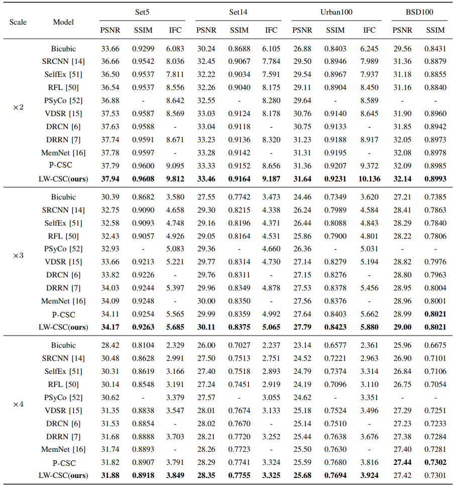
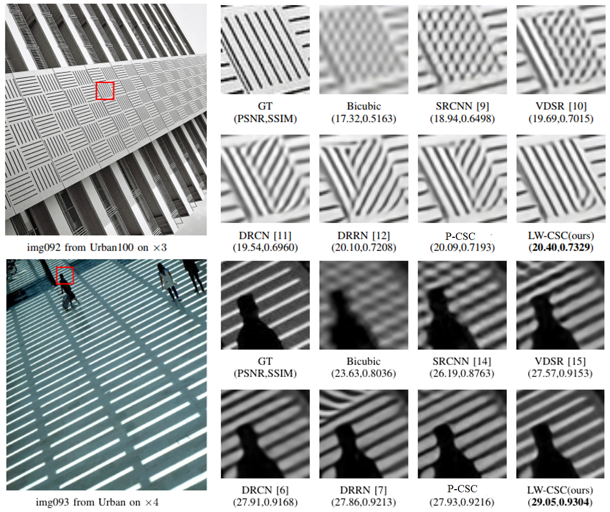
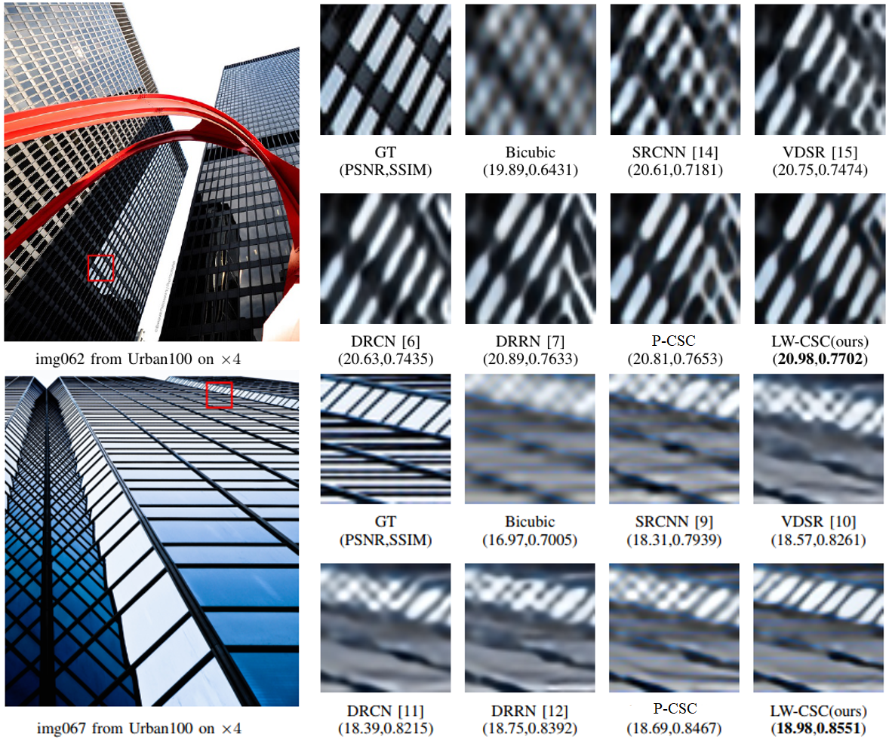

# This repository is for LW-CSC

## Contents
1. [Introduction](#introduction)
2. [Dependencies](#dependencies)
3. [Train](#train)
4. [Test](#test)
5. [Results](#results)
6. [Acknowledgements](#acknowledgements)

## Introduction
<div  align="center">    
   
</div>
<div  align="center">    
Figure 1. Architecture of the proposed LW-CSC.
</div>

## Dependencies
* Python 2 (Recommend to use [Anaconda](https://www.anaconda.com/distribution/#linux))
* [Pytorch 1.0.1](https://pytorch.org/)
* NVIDIA GPU + [CUDA](https://developer.nvidia.com/cuda-downloads)
* Python packages: pip install xxx
## Train
### Prepare training data
1. Download the 291 images ([Baidu Netdisk](https://pan.baidu.com/s/1bEajYJm_X5aVoXdS3RcbQg) psw:ryjr), and place them in './data' folder.
2. cd to './data', and run xxx.xx to generate training data.

### Begin to train
1. (optional) Download the model for our paper and place it in './model'.
2. Run the following script to train.

    ```bash
    bash train.sh
    ```

## Test
### Quick start
Run xxx.m to reproduce PSNR/SSIM/IFCs for paper.
### The whole test pipeline
1. Download the model for our paper and place it in './model'.
2. Run eval.py to generate *.mat for test.
3. Run xxx.m to reproduce PSNR/SSIM/IFCs for paper.

## Results
### Quantitative Results

Table 1. Average PSNR/SSIM/IFCs for scale factor x2, x3 and x4  on common benchmarks. The best results appear  **in bold**.
<div  align="center">    
   
</div>

### Visual Results
<div  align="center">    
   
</div>

<div  align="center">    
   
</div>

**All of these comparisons mainly show the effectiveness of our proposed method.**


## Acknowledgements
